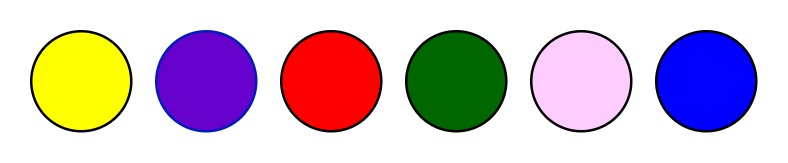
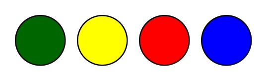
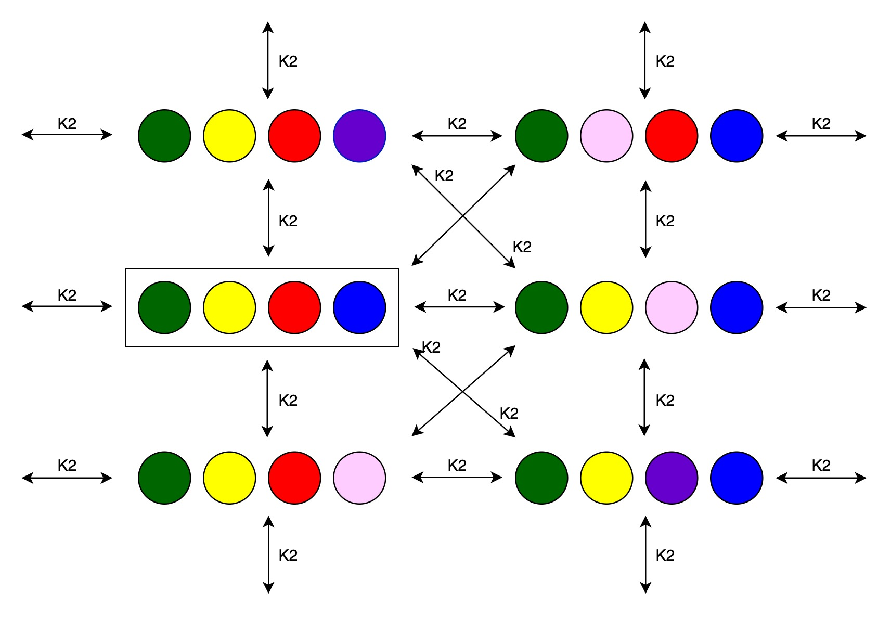
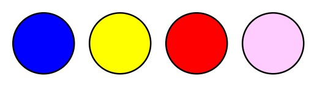
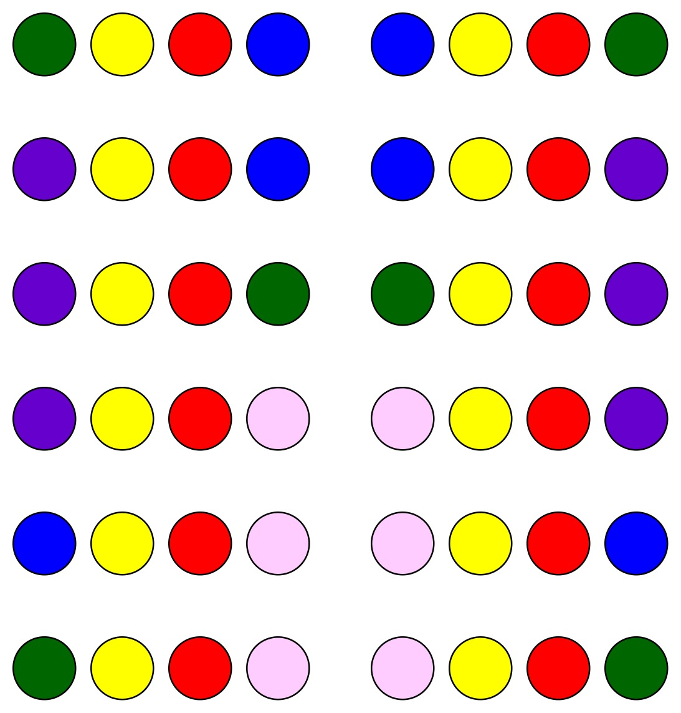
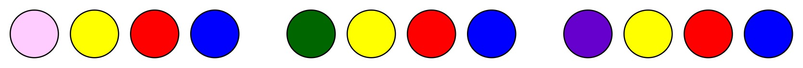
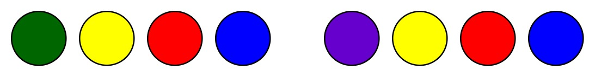

# Mastermind : The Game

The game Mastermind has two players :
* Player 1 : Code-maker
* Player 2 : Code-breaker

The game starts with code-maker deciding on a secret code, which needs to be guessed by code-breaker within certain number of guesses. There are 6 colors available. The secret code and every guess needs to abide by following rules :
* Length of code/guess should be 4.
* There should be 4 different colors. Repetition of colors within a code/guess is not allowed.

Once code-maker decides over a secret code, code-breaker attempts to guess it. Each move consists of a guess by code-breaker. Code-maker analyses this move, and generates a feedback based on its equivalency to the secret code. This feedback is in accordance with the following rules :
* It has 4 elements.
* If element value = 1  : It means the color and position both are correctly guessed for the element at this position.
* If element value = 0  : It means an element of this color is present somewhere in the code, but not at this position.
* If element value = -1 : It means there is no element of this color in the code.

Code-breaker uses this feedback on its previous move to generate the next move. If it is able to make a correct guess within 5 moves, it wins, otherwise the code-maker wins.

## Epistemic Logic Application

We can use Kripke Models, bound within S5 Axiom System, to analyse the logical aspects of the two agents (players) present in the game here.

We have the following 6 colors available.

Code-maker needs to chose a secret code of length 4, with no duplicates. Suppose the secret code chosen by the code-maker be :

Talking in terms of Kripke Model, we can say that :
* Real world is the same as the secret code.
* Code-maker considers only the real world to be possible, because it knows the actual code.
* Code-breker considers all the possible worlds in the beginning of the game. Therefore, with no repetitions, there are 120 worlds possible for the code-breaker.

Using the knowledge operator <b>K</b>, we can assert the following :
* Code-maker can access only the real world.
* Code breaker can access all the worlds from all the other worlds.
* Considering reflexive relations:
    * Code-maker possesses reflexive relations on all the worlds. This is because, whatever is the world, code-maker knows about it.
    * Code-breaker also possesses reflexive relations on all the worlds. This is because, regardless of what the real world is, code-breaker considers every world possible.

For example, if we consider a few relations and a few worlds, following Kripke Model is acheived :

Here :
* Agent 1 is the code-maker and agent 2 is the code-breaker.
* World within a square boundary is the real world.
* There exists a reflexive relation for both the agents at every world.
* There are other relations and other worlds possible as well, but we have skipped them to maintain the simplicity of the diagram.
* R2 are the knowledge relations for agent 2.

Here, colors are the propositional variables. In each world, the possible code decides which propositions are true. For example, for the real world :

Following is the `pi` value of this world :
* green = true
* yellow = true
* red = true
* blue = true
* pink = false
* violet = false

Given the above relations and model, we can summarise that :
* Agent 1 can access worlds only through reflexive relations. This means, whatever  is the state of the system, agent 1 knows it.
* Agent 2 can access all worlds from all other worlds, especially at the start of the game.

### Higher Order Knowledge

Now, when the game proceeds, code-breaker makes guesses and code-maker provides feedback by analysing them with respect tot he secret code.

Accounting this in terms of public announcement logic, the feedback is a truthful public announcement. It allows code-breaker to narrow down the possible worlds and make a viable next guess.

For example, given the above code, if player 2 makes the following guess :

Player 1 provides the following feedback : `[0 1 1 -1]`

This means that:
* First color blue occus in the secret code, but not at the first position.
* Second color yellow is correctly placed as in the secret code. It does not need any change.
* Third color red is correctly placed as in the secret code. It does not need any change.
* Fourth color pink is incorrect. It does not appear in the secret code, and needs to be replaced.

The above announcements are made publicly in the game, and become common knowledge henceforth.

Thus, after these announcements, the Kripke Model gets restricted as follows :
* Second and third colors have to be yellow and red respectively. All the worlds with other possibilities for second and third colors are eliminated. Following worlds would be possible :

    

* Blue needs to be somewhere other than the first position. But since second and third position are already occupied, blue can only occur at fourth position. This eliminates all the worlds with any other color on fourth position, or blue color in any other position. Following worlds would be possible :

    

* Only place left vacant is the first one. This position is occupied by any color other than pink. Thus, all the worlds with pink in any place on the code are eliminated. Following worlds would be possible :

    

Both the agents are aware of this elimination process, and it becomes common knowledge in the system. Based on the derived system, Player 2 can now make a second guess. Player 1 would again analyse it and provide feedback. Similar procedure would be followed and the game continues.

Using this logic, a game of Mastermind becomes a series of restrictions on the Kripke model until Player 2 has access to only one world and thereby knows the secret code. However, this restriction process is lmiited to only 5 moves. If Player 2 still is unable to make the correct guess, Player 1 wins.

