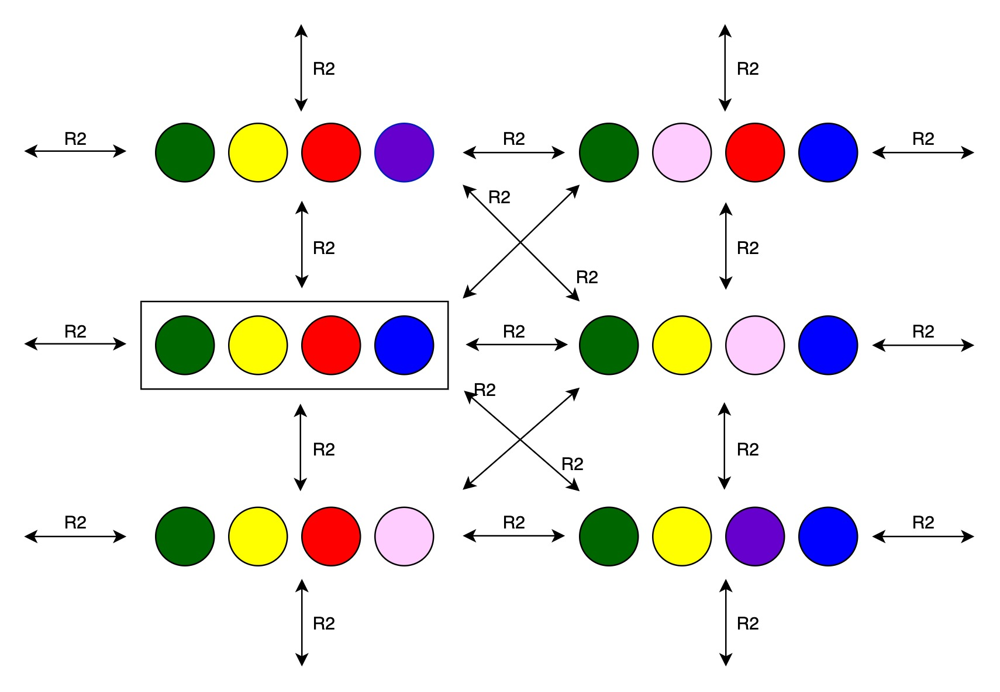

# Mastermind : The Game

The game Mastermind has two players :
* Player 1 : Code-maker
* Player 2 : Code-breaker

The game starts with code-maker deciding on a secret code, which needs to be guessed by code-breaker within certain number of guesses. There are 6 colors available. The secret code and every guess needs to abide by following rules :
* Length of code/guess should be 4.
* There should be 4 different colors. Repetition of colors within a code/guess is not allowed.

Once code-maker decides over a secret code, code-breaker attempts to guess it. Each move consists of a guess by code-breaker. Code-maker analyses this move, and generates a feedback based on its equivalency to the secret code. This feedback is in accordance with the following rules :
* It has 4 elements.
* If element value = 1  : It means the color and position both are correctly guessed for the element at this position.
* If element value = 0  : It means an element of this color is present somewhere in the code, but not at this position.
* If element value = -1 : It means there is no element of this color in the code.

Code-breaker uses this feedback on its previous move to generate the next move. If it is able to make a correct guess within 3 moves, it wins, otherwise the code-maker wins.

## Epistemic Logic Application

We can use Kripke Models, bound within S5 Axiom System, to analyse the logical aspects of the two agents (players) present in the game here.

We have the following 6 colors available.

Code-maker needs to chose a secret code of length 4, with no duplicates. Suppose the secret code chosen by the code-maker be :

Talking in terms of Kripke Model, we can say that :
* Real world is the same as the secret code.
* Code-maker considers only the real world to be possible, because it knows the actual code.
* Code-breker considers all the possible worlds in the beginning of the game. Therefore, with no repetitions, there are 120 worlds possible for the code-breaker.

Using the knowledge operator <b>K</b>, we can assert the following :
* Code-maker can access only the real world.
* Code breaker can access all the worlds from all the other worlds.
* Considering reflexive relations:
    * Code-maker possesses reflexive relations on all the worlds. This is because, whatever is the world, code-maker knows about it.
    * Code-breaker also possesses reflexive relations on all the worlds. This is because, regardless of what the real world is, code-breaker considers every world possible.

For example, if we consider a few relations and a few worlds, following Kripke Model is acheived :

Here :
* Agent 1 is the code-maker and agent 2 is the code-breaker.
* World within a square boundary is the real world.
* There exists a reflexive relation for both the agents at every world.
* There are other relations and other worlds possible as well, but we have skipped them to maintain the simplicity of the diagram.
* R2 are the knowledge relations for agent 2.

Here, colors are the propositional variables. In each world, the possible code decides which propositions are true. For example, for the real world :

Following is the `pi` value of this world :
* green = true
* yellow = true
* red = true
* blue = true
* pink = false
* violet = false

Given the above relations and model, we can summarise that :
* Agent 1 can access worlds only through reflexive relations. This means, whatever  is the state of the system, agent 1 knows it.
* Agent 2 can access all worlds from all other worlds, especially at the start of the game.

### Higher Order Knowledge

Now, when the game proceeds, code-breaker makes guesses and code-maker provides feedback by analysing them with respect tot he secret code.

Accounting this in terms of public announcement logic, the feedback is a truthful public announcement. It allows code-breaker to narrow down the possible worlds and make a viable next guess.

For example, given the above code, if player 2 makes the following guess :

Player 1 provides the following feedback : `[0 1 1 -1]`

This means that:
* First color blue occus in the secret code, but not at the first position.
* Second color yellow is correctly placed as in the secret code. It does not need any change.
* Third color red is correctly placed as in the secret code. It does not need any change.
* Fourth color pink is incorrect. It does not appear in the secret code, and needs to be replaced.

The above announcements are made publicly in the game, and become common knowledge henceforth.

Thus, after these announcements, the Kripke Model gets restricted as follows :
* Second and third colors have to be yellow and red respectively. All the worlds with other possibilities for second and third colors are eliminated. Following worlds would be possible :

    

* Blue needs to be somewhere other than the first position. But since second and third position are already occupied, blue can only occur at fourth position. This eliminates all the worlds with any other color on fourth position, or blue color in any other position. Following worlds would be possible :

    

* Only place left vacant is the first one. This position is occupied by any color other than pink. Thus, all the worlds with pink in any place on the code are eliminated. Following worlds would be possible :

    

Both the agents are aware of this elimination process, and it becomes common knowledge in the system. Based on the derived system, Player 2 can now make a second guess. Player 1 would again analyse it and provide feedback. Similar procedure would be followed and the game continues.

Using this logic, a game of Mastermind becomes a series of restrictions on the Kripke model until Player 2 has access to only one world and thereby knows the secret code. However, this restriction process is lmiited to only 5 moves. If Player 2 still is unable to make the correct guess, Player 1 wins.

### Agent Knowledge

We monitor the common knowledge, and individual knowledge accummulated by both the agents throughout the game.

* A knowledge proposition known with surety is expressed as `<position>:<color>`.
* A negation known with surety is expressed as `~(<position>:<color>)`.
* An unsure knowledge proposition which may or may not hold is expressed as `*(<position>:<color>)`.

Common Knowledge is collectively available to both agents, however `agent1` knowledge and `agent2` knowledge is only available to the respective agents indivdually. We have `agent1` as the code-maker, and `agent2` as the code-breaker.

`Agent1` individual knowledge is only updated once, when he generates the code. For example, if the following code is generated :

`agent1` knowledge is updated accordingly. He knows for the sure the correct position of all the colors in the code, thus he adds a knowledge proposition for each of them to his individual knowledge base.
* `Green` at position 1 : `1:green`
* `Yellow` at postion 2 : `2:yellow`
* `Red` at position 3 : `3:red`
* `Blue` at position 4 : `4:blue`

However, the common knowledge ant `agent2` knowledge are updated with every move and feedback generated therein. For example, suppose we get the feedback `[0 1 1 -1]` for the following move :

Since the feedback is a public announcement in the game, we get the following agent knowledge propositions :

* For first color `blue` with feedback `0` :
    * Common Knowledge : `Blue` is not present at position 1, i.e., `~(1:blue)`.
    * Agent 2 Knowledge : It can deduce that `blue` is either at position 2 or 3 or 4, i.e., `*(2:blue)`, `*(3:blue)` and `*(4:blue)`.
* For second color `yellow` with feedback `1`:
    * Common Knowledge : `Yellow` is present at position 2, i.e., `(2:yellow)`.
    * Agent 2 Knowledge : Code breaker can deduce that no other color is present at position 2, i.e., `~(2:violet)`, `~(2:red)`, `~(2:green)`, `~(2:pink)` and `~(2:blue)`.
* For third color `red` with feedback `1`:
    * Common Knowledge : `Red` is present at position 3, i.e., `(3:red)`.
    * Agent 3 Knowledge : Code breaker can deduce that no other color is present at position 3, i.e., `~(3:violet)`, `~(3:yellow)`, `~(3:green)`, `~(3:pink)` and `~(3:blue)`.
* For fourth color `pink` with feedback `-1`:
    * Common Knowledge : `Pink` is not present at any position i.e., `~(1:pink)`, `~(2:pink)`, `~(3:pink)` and `~(4:pink)`
    * Agent 2 Knowledege : In addition to common knowledge, agent 2 can deduce that any other color may be present at position 4, i.e., `*(4:yellow)`, `*(4:violet)`, `*(4:red)`, `*(4:green)` and `*(4:blue)`.

## Strategies

We have implemented three strategies for the code-breaker here. They are explained below :

### 1. Mathematician Code Breaker

Under this strategy, the code-breaker analyses the feedback on each of his previous moves to generate the next move. However, information learnt from older moves is not maintained. Only the immediately last move is examined with the feedback obtained, and next move is generated.

For example, if the feedback obtained is `[0 1 0 -1]`,  for the following move :

For the next move, code-breaker knows that :
* Yellow is perfectly correct, and need not be changed.
* Blue and green needs to be in a different position. Since both 1st, 3rd and 4th positions are free to be occupied, they can be placed in any of these randomly.
* Pink needs to be replaced, and placed in any of the available empty positions. Any other color (green or violet) and its position from the available empty positions will be chosen randomly for the next move.

However, since the learnings from older moves are not maintained,
* Even if blue placed at position 3 is wrong and this was learnt in an older move, still there is a chance for it to be placed at position 3 again in the next move.
* It is possible that color violet is randomly chosen to replace pink, even though it was already violet in one of the previous moves, and was replaced by pink in the last move, on receiving a feedback `-1` then.

Thus, this strategy is not entirely efficient.

### 2. Logician Code Breaker

Here, code-breaker makes use of the knowledge model maintained in the game to make a decision about the next move. As we see in the `Game` class, knowledge model is updated after every move.

Every move, along with the feedback generated for it, is analysed, and the Kripke Model is solved for it. The feedback acts as public announement, and thus the worlds which do not satisfy it are eliminated.

For example, if the feedback obtained is `[0 1 0 -1]`,  for the following move :

In the available Kripke model :
* Worlds where second color is not yellow wll be eliminated.
* Worlds where first color is blue, or third color is green will be eliminated.
* Worlds where pink is present in any of the positions will be eliminated.

Such an elimination is carried out after every move. Thus the number of worlds in the model reduce after every move. In this strategy, for the next move, code-breaker randomly chooses a world from the worlds available after the analysis of the previous move.

Thus, this strategy is the most efficient one, because information is never lost here. Learnings made in every move are carried over, and every decision is made based on the all the previous learnings in the game.

### 3. Random Code Breaker

Here, no instance of available knowledge, be it feedback from the code-maker, or the knowledge model maintained in the game is used to make a decision about the next move.

Every move is generated randomly, and is independent of the previous moves, or the current states of the game.

This is the least efficient strategy, and rarely does the code-breaker win a game with this strategy.

### Simulations

We run 20 game simulations.

For every game, a new code is generated, and a new knowledge model is created. A code-breaker for each of the above stated three strategies is given a chance to play the game, and the winner is recorded.

The score about the number of games won by each of the 3 code-breaker strategies is posted at the end of the simulation.

## Project Implementation

We implemented the game in python.

We create two classes, one each for code-maker and the code-breaker. Code-breaker class initialises by randomly generating a code. Code-breaker attempts to guess this code within 3 moves.

We use a knowledge-manager class to represent the Kripke Model (possible worlds and their relations) according to the current state of the game. There is also an agent-knowledge class which maintains the commong knowledge and individual knowledge propositions for both agents at every state of the game.

The game class taked the responsibility to bring all these features together, and conduct a game. In each move, code-breaker makes a guess, and code-maker provides feedback. The knowledge base in Kripke model and agent knowledge is updated accordingly. We have three strategies in place for code-breaker, however the game by default runs for mathematician code-breaker.

Strategy analyser class provides an interface to run simulation games to compare the three strategies available.
